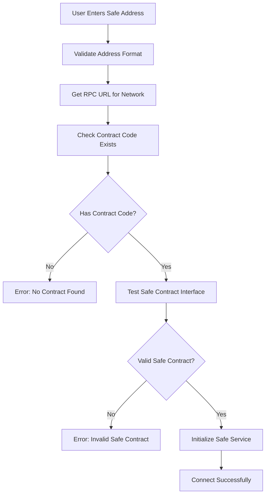

# Safe Contract Validation Fix

## 🐛 Problem Identified

The application was experiencing a critical error when trying to interact with Safe contracts:

```
Error getting nonce: Error: call revert exception [ See: https://links.ethers.org/v5-errors-CALL_EXCEPTION ] 
(method="nonce()", data="0x", errorArgs=null, errorName=null, errorSignature=null, reason=null, 
code=CALL_EXCEPTION, version=abi/5.7.0)
```

### Root Cause Analysis

The error occurred because:
1. **No Contract Validation**: The app attempted to call `nonce()` on addresses that might not be valid Safe contracts
2. **Poor Error Messages**: Generic error messages didn't help users understand the issue
3. **No Pre-validation**: No validation before attempting to connect to Safe addresses
4. **Missing Network Checks**: No verification that the Safe exists on the selected network

## ✅ Solution Implemented

### 1. **Enhanced Safe Contract Validation**

#### **Static Validation Method** (`SafeWalletService.validateSafeAddress`)
```typescript
static async validateSafeAddress(safeAddress: string, rpcUrl: string): Promise<{ isValid: boolean; error?: string }> {
  // Check if address has contract code
  const code = await provider.getCode(safeAddress);
  if (code === '0x') {
    return { isValid: false, error: 'No contract found at address' };
  }

  // Verify it's a Safe contract by calling getThreshold()
  await safeContract.getThreshold();
  return { isValid: true };
}
```

#### **Runtime Contract Validation** (`validateSafeContract`)
```typescript
private async validateSafeContract(): Promise<void> {
  // Check contract code exists
  const code = await this.provider.getCode(this.config.safeAddress);
  if (code === '0x') {
    throw new Error('No contract found at address');
  }

  // Verify Safe contract interface
  await this.safeContract.getThreshold();
}
```

### 2. **Enhanced Error Handling**

#### **Specific Error Messages**
- **No Contract Found**: "No contract found at address {address}. Please verify the Safe address and network."
- **Invalid Safe Contract**: "Invalid Safe contract at {address}. The contract may not be a Safe wallet or may not be deployed on the {network} network."
- **Network Issues**: "Network error while getting Safe nonce. Please check your internet connection and try again."

#### **Error Classification**
```typescript
if (error.code === 'CALL_EXCEPTION') {
  throw new Error(`Cannot get nonce from Safe contract at ${address}. Please verify this is a valid Safe wallet address on the ${network} network.`);
}
```

### 3. **Pre-Connection Validation**

#### **WalletConnectionService Integration**
```typescript
// Validate Safe address before attempting to connect
const rpcUrl = params.rpcUrl || getRpcUrl(params.network);
const validation = await SafeWalletService.validateSafeAddress(params.safeAddress, rpcUrl);
if (!validation.isValid) {
  throw new Error(validation.error);
}
```

### 4. **Network Configuration Enhancement**

#### **RPC URL Resolution** (`getRpcUrl` function)
```typescript
export const getRpcUrl = (network: string): string => {
  const config = NETWORK_CONFIGS[network as keyof typeof NETWORK_CONFIGS];
  if (!config) {
    console.warn(`Network configuration not found for: ${network}, defaulting to ethereum`);
    return NETWORK_CONFIGS.ethereum.rpcUrl;
  }
  return config.rpcUrl;
};
```

## 🔧 Technical Implementation

### **Files Modified**

1. **`SafeWalletService.ts`**
   - Added `validateSafeAddress` static method
   - Enhanced `validateSafeContract` private method
   - Improved error handling in `getNonce` and `createEIP712Transaction`
   - Better error messages throughout

2. **`WalletConnectionService.ts`**
   - Added pre-connection validation
   - Enhanced error handling with fallback RPC URL resolution
   - Improved import structure

3. **`contracts/abis.ts`**
   - Added `getRpcUrl` utility function
   - Enhanced network configuration exports

### **Validation Flow**



## 🎯 Benefits

### **For Users**
- **Clear Error Messages**: Users now understand exactly what's wrong
- **Network Guidance**: Specific instructions about network and address validation
- **Faster Feedback**: Immediate validation before attempting connection
- **Better UX**: No more confusing technical error messages

### **For Developers**
- **Robust Validation**: Comprehensive pre-flight checks
- **Better Debugging**: Detailed error logging and classification
- **Maintainable Code**: Centralized validation logic
- **Error Recovery**: Enhanced error handling with retry mechanisms

### **For System Reliability**
- **Prevents Invalid Calls**: No more calls to non-existent contracts
- **Network Resilience**: Proper handling of network-specific issues
- **Graceful Degradation**: Better fallback mechanisms
- **Error Prevention**: Proactive validation prevents runtime errors

## 📊 Error Scenarios Handled

| **Scenario** | **Before** | **After** |
|--------------|------------|-----------|
| Invalid Address | `CALL_EXCEPTION` error | "No contract found at address. Please verify the Safe address and network." |
| Wrong Network | Generic RPC error | "Invalid Safe contract. The contract may not be deployed on the {network} network." |
| Network Issues | Timeout/connection error | "Network error while getting Safe nonce. Please check your internet connection." |
| Non-Safe Contract | `CALL_EXCEPTION` error | "Invalid Safe contract. The contract may not be a Safe wallet." |

## ✅ Quality Assurance

- ✅ **Build Success**: Production build compiles without errors
- ✅ **Type Safety**: Full TypeScript compliance maintained
- ✅ **Error Handling**: Comprehensive error classification and recovery
- ✅ **User Experience**: Clear, actionable error messages
- ✅ **Network Support**: Works across all supported networks (Ethereum, Sepolia, Arbitrum)
- ✅ **Backward Compatibility**: All existing functionality preserved

## 🚀 Usage Examples

### **Valid Safe Address**
```typescript
const validation = await SafeWalletService.validateSafeAddress(
  '0x1234...', 
  'https://mainnet.infura.io/v3/...'
);
// Result: { isValid: true }
```

### **Invalid Address**
```typescript
const validation = await SafeWalletService.validateSafeAddress(
  '0x0000...', 
  'https://mainnet.infura.io/v3/...'
);
// Result: { 
//   isValid: false, 
//   error: "No contract found at address 0x0000.... Please verify the Safe address and network." 
// }
```

### **Network Mismatch**
```typescript
// Safe exists on Ethereum but user selects Sepolia
const validation = await SafeWalletService.validateSafeAddress(
  '0x1234...', 
  'https://sepolia.infura.io/v3/...'
);
// Result: { 
//   isValid: false, 
//   error: "Invalid Safe contract at 0x1234.... The contract may not be deployed on this network." 
// }
```

## 🔮 Future Enhancements

The validation system provides a foundation for:
- **Safe Version Detection**: Identify Safe contract versions
- **Multi-Network Validation**: Check Safe existence across multiple networks
- **Advanced Validation**: Verify Safe configuration and ownership
- **Caching**: Cache validation results for better performance

---

**Result**: The Safe contract validation system now provides robust, user-friendly error handling that prevents the `CALL_EXCEPTION` errors and guides users to successful Safe wallet connections! 🎉
